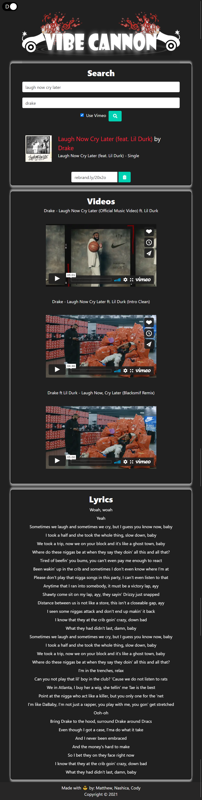
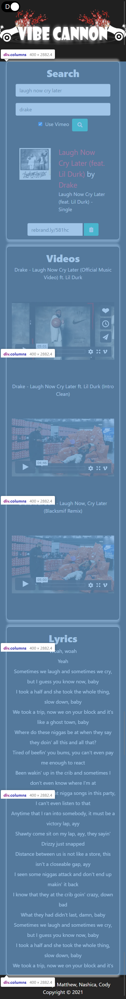

 

We are team vibes.  After the world experienced the biggest <b>404</b> error in our lifetime, aka  2020, as web developers we decided that the world needs some good vibes. Unlike the coronavirus, when music hits you, you feel no pain. So we created an entertainment application that allows you to search, access information, watch videos, learn and even sing along to the lyrics of your favourite songs. Vibe Cannon, would you like some good vibes fired your way for 2021?

## Table of Contents
* [General Information](#general-information)
* [Contributors](#contributors)
* [Technology](#technology)
* [Deployment and Demo](#deployment-and-demo)
* [Screenshots](#screenshots)
* [License](#license)

## General Information

#### User Story:
As a person experiencing lockdown due to a global pandemic, I want to be able to search for my favorite songs. I am given information, videos and the lyrics of these songs so that I can entertain myself, as all public music entertainment events have been cancelled.

#### Project description:
Vibe Cannon is an entertainment application that allows the user to access their favorite songs. In addition, the user is able get information from about the song, watch music videos as well as access lyrics if they are available. We have used the most popular music api to access this information, so Vibe Cannon is your one stop shop for you music entertainment needs.

##### When the page loads:
- The user is able to enter the name of the artiste and the name of the song.
- The default video play is YouTube, however the user has the option to view Vimeo videos. (YouTube API has 50 daily video per call, once quota is up Vimeo video will play as default)
- When the user clicks the search button, they get a link to itunes with information about the song, the top 3 videos and the lyrics of the song (if avaialable).
- The song title field is always required, however the user is able to enter part of a song they remember, even if they dont know the name of the artiste.

## Contributors
*  Cody Yuill [https://github.com/CodyYuill](https://github.com/CodyYuill)
*  Matthew Guillen [https://github.com/GuilleMGN](https://github.com/GuilleMGN)
*  Nashica Walters[https://github.com/nashwalters](https://github.com/nashwalters)

## Technology

The APIs used are listed below:

* [Rebrandly](https://developers.rebrandly.com/docs)
* [Lyrics.ovh](https://lyricsovh.docs.apiary.io/#)
* [Itunes](https://affiliate.itunes.apple.com/resources/documentation/itunes-store-web-service-search-api/)
* [Vimeo](https://developer.vimeo.com/)
* [YouTube](https://developers.google.com/youtube/)

## Deployment and Demo

[Click here for some good vibes!!](https://codyyuill.github.io/Vibe-Cannon/)

## Screenshots
### Application in light Mode

### Application in Dark Mode

### The user interface is responsive and adapts to all screen sizes. Click on the arrows to drop down more images at various screen sizes.

  
Large Screen

  

  
Medium Screen

   

  
Small Screen

   

## License 

Copyright © 2021
